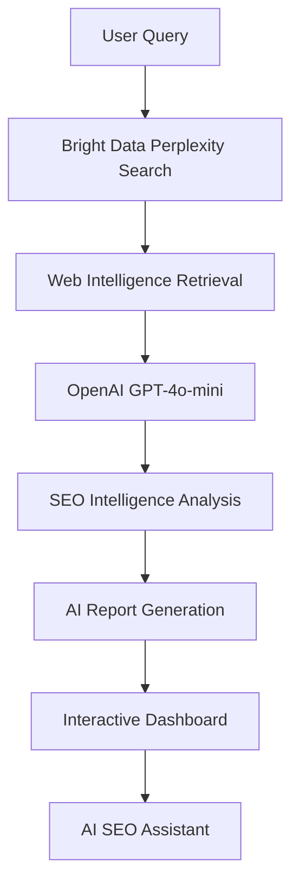

# 🚀 BrightSEO AI — Agentic SEO Intelligence SaaS

An Agentic-AI powered SEO intelligence platform that automates competitor research, backlink analysis, SERP intelligence, and AI-driven SEO workflows using OpenAI GPT-4o-mini, Bright Data Perplexity Search APIs, and real-time web intelligence pipelines.

This project demonstrates how Agentic AI + LLM workflows can be integrated into modern SaaS architectures to transform raw web data into structured, actionable SEO intelligence.


---

# 🌐 Live Demo

🔗 Live Product
https://ai-powered-seo-saas.vercel.app/

---

# 📖 Overview

Traditional SEO workflows often require switching between multiple tools for:

* competitor analysis
* backlink research
* SERP tracking
* keyword intelligence
* SEO reporting

This project demonstrates an AI-native SEO workflow system where:

1. Live web intelligence is retrieved dynamically
2. AI workflows analyze SEO-related signals
3. Structured SEO reports are generated automatically
4. Users interact with reports through contextual AI conversations

The platform combines:

* Agentic AI workflows
* tool-calling systems
* prompt-driven web intelligence retrieval
* interactive SaaS dashboards
* AI-powered SEO reasoning

---

# 🧠 Architecture



---

# ✨ Features

| Feature                                  | Description                                                 |
| ---------------------------------------- | ----------------------------------------------------------- |
| **Agentic AI SEO Workflows**             | Automated SEO intelligence pipelines using AI orchestration |
| **Competitor Analysis**                  | Identify competitors, strengths, and visibility signals     |
| **Backlink Intelligence**                | Extract backlink sources and authority insights             |
| **SERP Analysis**                        | Analyze search visibility and SEO positioning               |
| **AI SEO Assistant**                     | Contextual AI conversations over generated reports          |
| **Interactive Dashboards**               | Responsive dashboards with visual SEO insights              |
| **Prompt-Driven Scraping**               | Bright Data Perplexity Search integration                   |
| **Tool Calling Workflows**               | Dynamic AI reasoning and contextual analysis                |
| **Authentication & SaaS Infrastructure** | Clerk-based auth and subscription workflows                 |
| **Responsive SaaS UI**                   | Modern mobile-first responsive architecture                 |

---

# ⚡ Advanced Agentic AI Capabilities

## 1. Tool-Calling SEO Workflows

The platform implements OpenAI tool-calling workflows to dynamically:

* fetch live SEO intelligence
* analyze competitors
* reason over backlink signals
* generate contextual recommendations

## 2. Prompt-Driven Web Intelligence

Bright Data Perplexity Search APIs are used for:

* live web retrieval
* SEO intelligence extraction
* SERP analysis workflows
* competitor discovery pipelines

## 3. Conversational SEO Reasoning

Users can interact with generated SEO reports through an AI assistant capable of:

* contextual report analysis
* SEO explanations
* competitor reasoning
* backlink interpretation

## 4. SaaS-Scale Architecture

The platform uses:

* Convex backend infrastructure
* real-time data workflows
* Clerk authentication
* scalable deployment pipelines
* responsive component systems

---

# 🛠 Tech Stack

## Frontend

* Next.js 15
* TypeScript
* Tailwind CSS
* shadcn/ui
* Recharts

## Backend & Infrastructure

* Convex
* Clerk Authentication
* Vercel Deployment

## AI & Intelligence Layer

* OpenAI GPT-4o-mini
* Bright Data Perplexity Search APIs
* Tool Calling Workflows
* AI Report Generation Pipelines

---

# ⚙️ Prerequisites

* Node.js 18+
* pnpm or npm
* Convex account
* Clerk account
* Bright Data account
* OpenAI API key

---

# 🚀 Installation

## 1. Clone Repository

```bash
git clone https://github.com/PavanMahindrakar/AI-powered-seo-saas.git
cd AI-powered-seo-saas
```

## 2. Install Dependencies

```bash
pnpm install
```

## 3. Configure Environment Variables

Create a `.env.local` file:

```env
# Convex
CONVEX_DEPLOYMENT=
NEXT_PUBLIC_CONVEX_URL=

# Clerk
NEXT_PUBLIC_CLERK_PUBLISHABLE_KEY=
CLERK_SECRET_KEY=

# OpenAI
OPENAI_API_KEY=

# Bright Data
BRIGHTDATA_API_KEY=
```

## 4. Initialize Convex

```bash
npx convex dev
```

## 5. Start Development Server

```bash
pnpm dev
```

Open:

```bash
http://localhost:3000
```

---

# 📊 Product Workflow

## 🚀 BrightSEO AI Demo Flow

1. Login / Create Account
2. Explore Features & Pricing
3. Subscribe to Pro Plan
4. Access AI Dashboard
5. Generate SEO Intelligence Report
6. Analyze Competitors & Backlinks
7. Use AI Assistant for SEO Insights

⚠️ SEO report generation may take around 5–10 minutes depending on live web intelligence retrieval and AI processing workflows.

---

# 📂 Project Structure

```bash
AI-powered-seo-saas/
├── app/                    # Next.js App Router
├── components/             # Reusable UI Components
├── convex/                 # Backend Functions & Schema
├── prompts/                # AI Prompt Workflows
├── actions/                # Server Actions
├── lib/                    # Utility Functions & Schemas
├── public/                 # Static Assets
└── README.md
```

---

# 📈 Use Cases

BrightSEO AI can help:

* SEO professionals
* digital marketers
* SaaS companies
* growth teams
* agencies
* startup founders

by automating SEO intelligence and reducing manual research effort.

---

# 🔮 Future Roadmap

* GEO / AI Search Optimization
* Multi-agent SEO workflows
* Automated competitor monitoring
* AI-powered keyword intelligence
* Browser automation workflows
* AI visibility scoring systems
* Real-time SEO monitoring agents

---

# 👨‍💻 Author

## Pavan Mahindrakar

---

If you found this project helpful, please consider giving it a star!

---